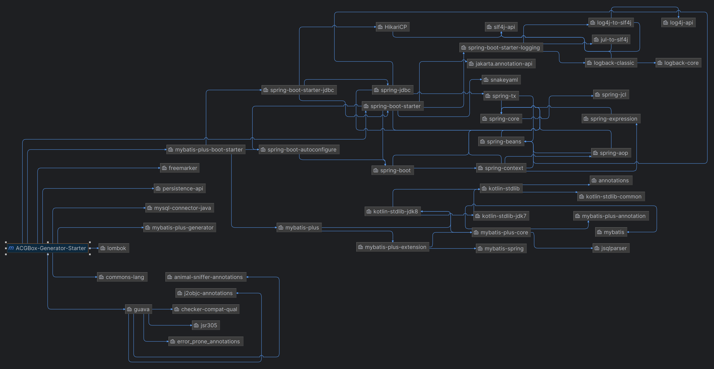

# 

## 快速开始：

&ensp;&ensp;&ensp;&ensp;引入启动依赖：

```xml
<dependency>
    <groupId>wiki.csbox</groupId>
    <artifactId>ACGBox-Generator-Starter</artifactId>
    <version>1.0</version>
</dependency>
```

&ensp;&ensp;&ensp;&ensp; `ACGBox-Generator-Starter` 依赖树如下：



&ensp;&ensp;&ensp;&ensp;注意需要在`application.yaml`中进行如下必须配置：

```yaml
# 逆向工程必须配置项：
csbox:
  generator:
    mysql:
      author: 开发人名字
      basicPackage: 代码生成的基础包路径
      tables:
        - 数据库表01
        - 数据库表02
        - ......

# 数据源信息
spring:
  datasource:
    url: jdbc:mysql://localhost:3306/数据库名?useUnicode=true&characterEncoding=UTF-8&serverTimezone=Asia/Shanghai&rewriteBatchedStatements=true
    driverClassName: com.mysql.cj.jdbc.Driver
    username: 数据库用户名
    password: 数据库密码
```

&ensp;&ensp;&ensp;&ensp;自动注入 `MySQLGenerator`后，调用`generatorCode()`方法即可完成逆向：

```java
@Autowired
private MySQLGenerator mySQLGenerator;

@Test
public void test() {
    mySQLGenerator.generatorCode();
}
```

---

## 开发日志：

&ensp;&ensp;&ensp;&ensp;这个仓库的定位是完成对 `MyBatis Plus wiki.csbox.generator.handler.strategy.MySQLGenerator` 代码生成的二次封装，在此基础上计划实现如下功能：

- [ ] 根据数据库表动态生成`MVC`三层架构代码和`Entity`实体类
- [ ] 根据指定实体类动态生成数据库表

&ensp;&ensp;&ensp;&ensp;在这个启动类中封装 `MyBatis Plus` 和 `MySQL` 数据库的所有依赖，暂时不支持其他数据库。


---

### 根据实体类生成数据库表：

1. 首先需要在配置文件中指定实体类的基础包路径。
2. 根据包路径去获取包路径下的所有的类（注意根据自定义注解去判断这个实体类是否需要生成数据库表）
3. 根据属性的注解进行SQL的拼接生成
4. 执行生成的SQL代码，创建数据库以及数据库表